# Learning Word Embeddings from Tagging Data: A Methodological Comparison

This repository contains the generated embeddings from the KDML submission ["Learning Word Embeddings from Tagging Data: A Methodological Comparison"](nolink)
by
[Thomas Niebler](http://www.dmir.uni-wuerzburg.de/staff/niebler),
Luzian Hahn and
[Andreas Hotho](http://www.dmir.uni-wuerzburg.de/staff/hotho).

## Overview
In our work, we compared the three embedding algorithms Word2Vec, GloVe and LINE with regard to their applicability
on tagging data from folksonomies and the semantic quality of the produced embeddings.

## Reference Implementations
We used the following embedding algorithm implementations in our work:
* word2vec: [GenSim implementation](https://radimrehurek.com/gensim/index.html)
* GloVe: [original code of GloVe](https://nlp.stanford.edu/projects/glove/)
* LINE: [original code of LINE](https://github.com/tangjianpku/LINE)

## Datasets
### Generated Vector Embeddings
We published the generated embeddings for each tagging dataset in the
[embeddings directory](https://github.com/thomasniebler/semantics-tagembeddings/tree/master/embeddings)
in the repository.

### Original tagging data
#### Delicious
The Delicious tagging dataset is [publicly available](http://www.zubiaga.org/datasets/socialbm0311).

#### BibSonomy
The BibSonomy tagging data can be retrieved from [the BibSonomy homepage](https://www.kde.cs.uni-kassel.de/bibsonomy/dumps/).

#### CiteULike
The CiteULike tagging data can be retrieved from [CiteULike](http://www.citeulike.org/faq/data.adp).

### Human Intuition Datasets
The Human Intuition Datasets (HIDs) can be retrieved as preprocessed pandas-friendly csv files 
[here](http://www.thomas-niebler.de/dataset-collection-for-evaluating-semantic-relatedness/)
or from the corresponding original locations.
* [WordSimilarity-353](http://www.cs.technion.ac.il/~gabr/resources/data/wordsim353/wordsim353.html)
* [MEN collection](https://staff.fnwi.uva.nl/e.bruni/MEN)
* [MTurk Dataset](http://www.kiraradinsky.com/Datasets.html)
* [Bib100](http://dmir.org/datasets/bib100/)

## Results not included in the paper
In the following, we will present the results for the experiments performed
in the paper, but evaluated on WS353, MTurk and Bib100.

### Word2Vec
#### WordSimilarity-353
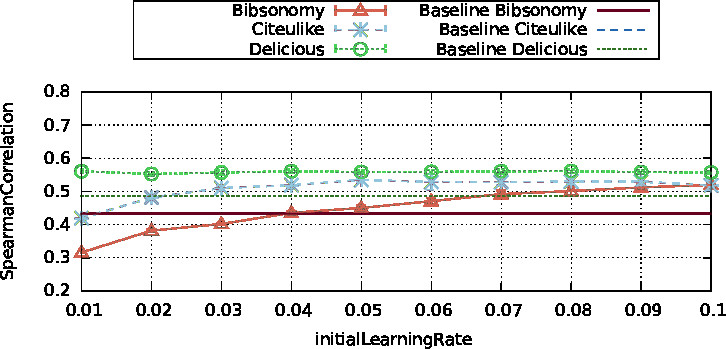

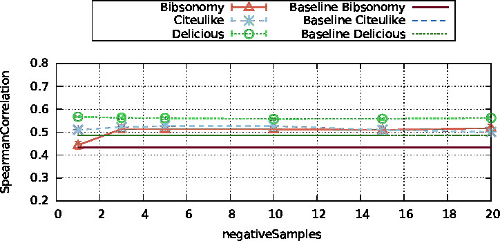
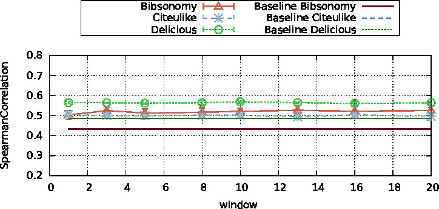

#### MTurk
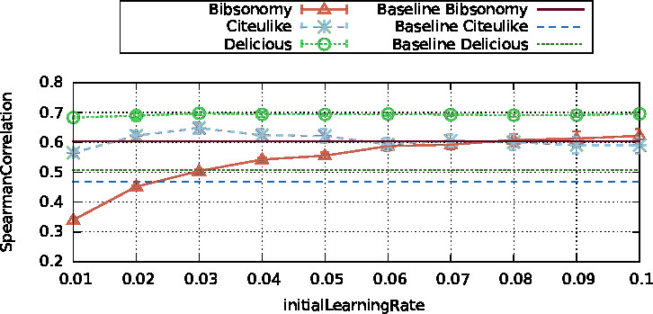
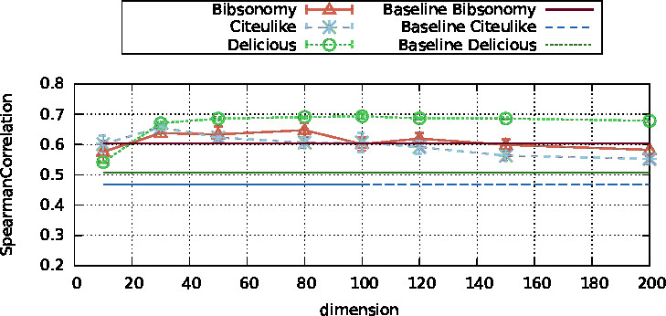

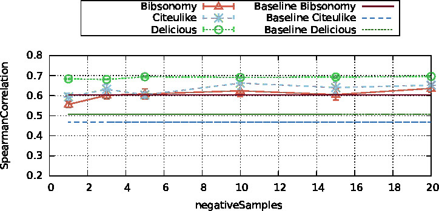
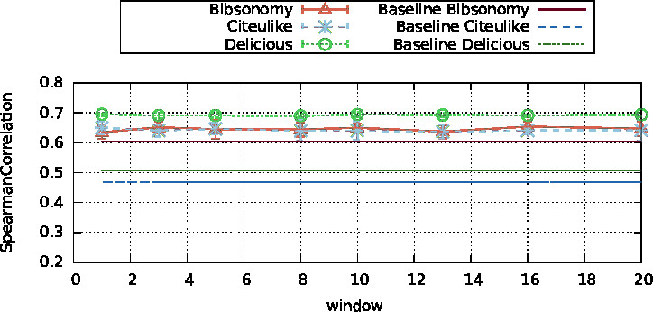

#### Bib100
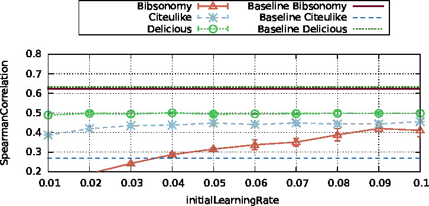
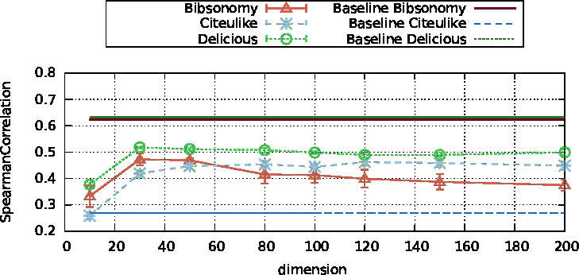

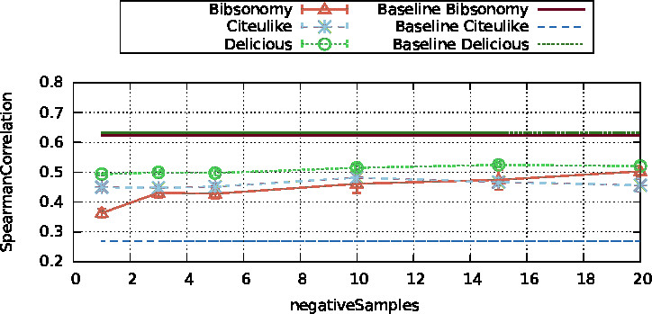
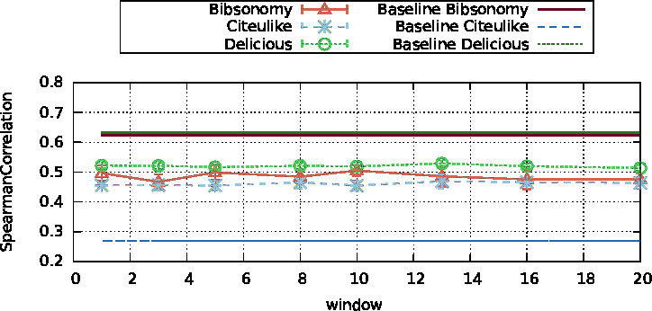

### GloVe
#### WordSimilarity-353
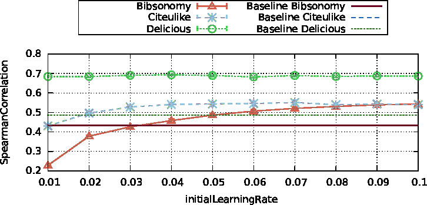
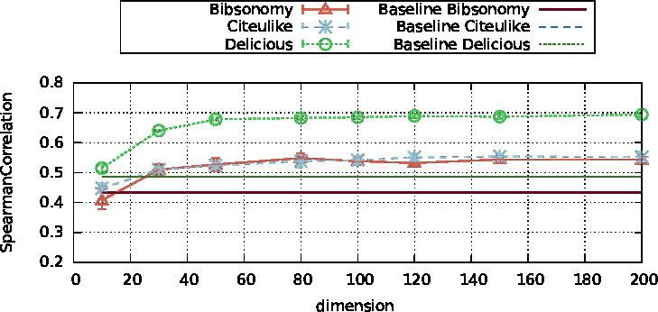

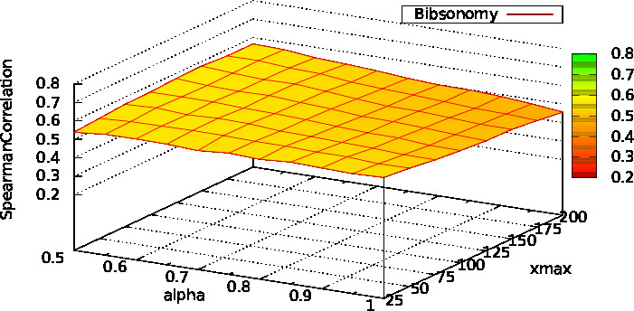
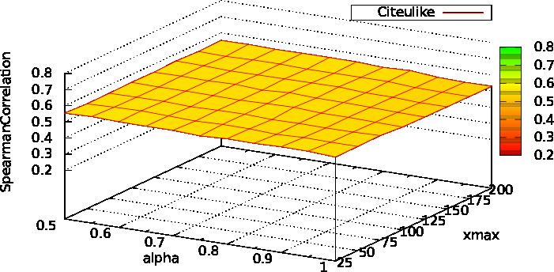
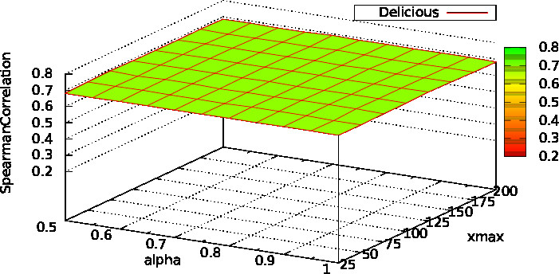

#### MTurk

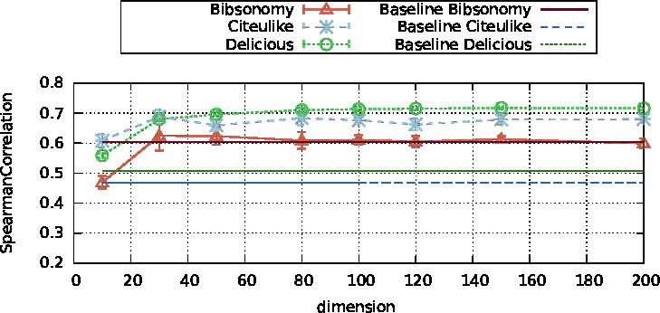

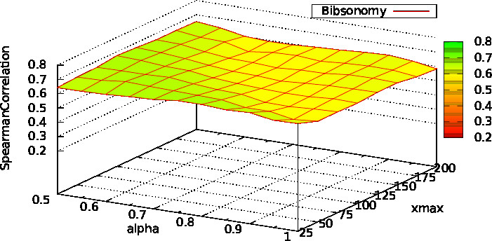
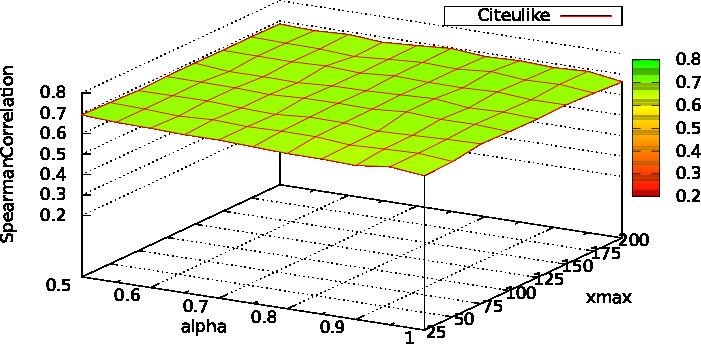
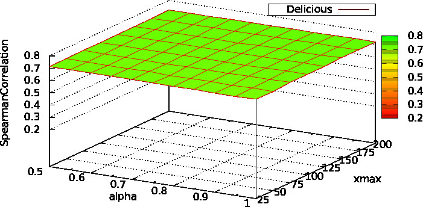

#### Bib100
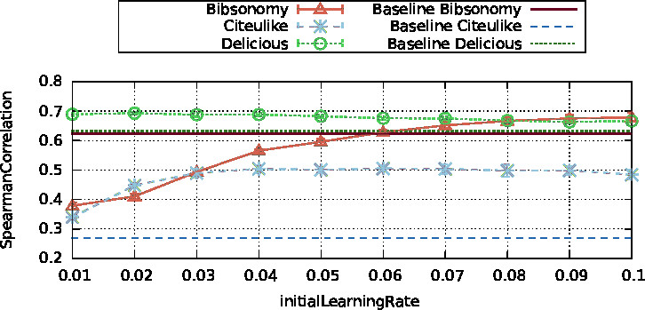
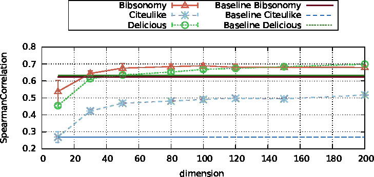

### LINE
#### WordSimilarity-353
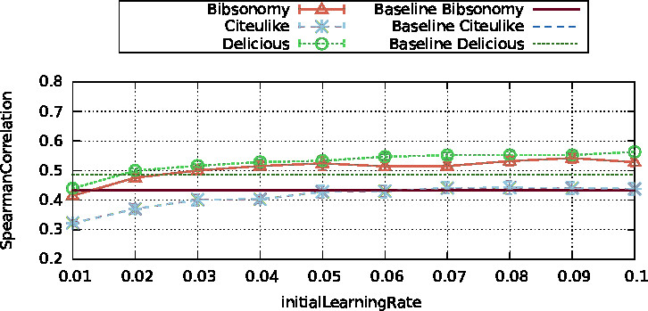

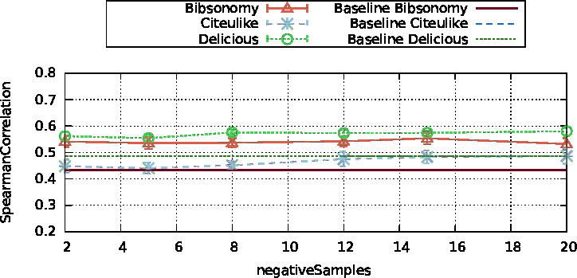
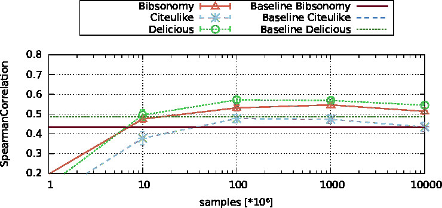

#### MTurk

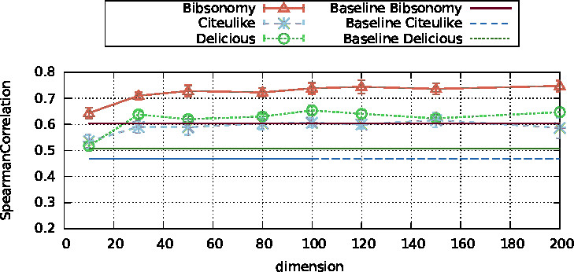

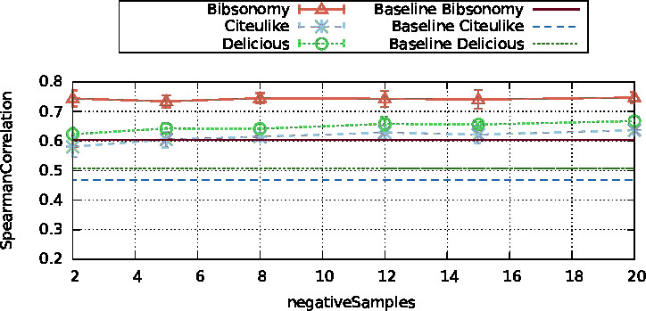

#### Bib100
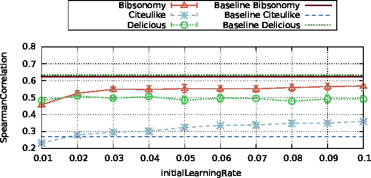
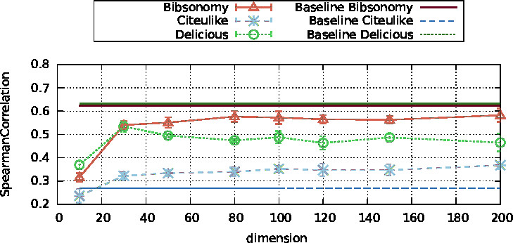

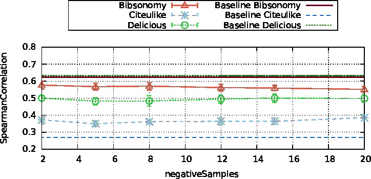
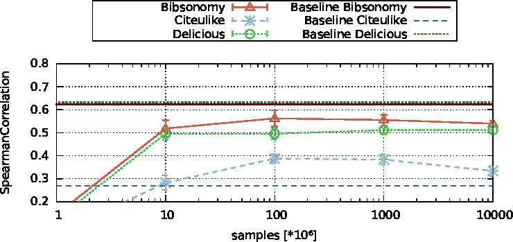

